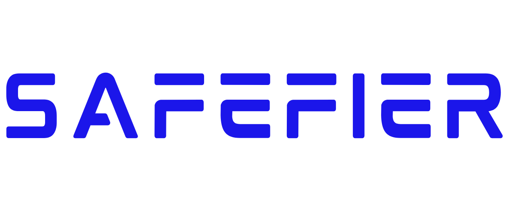

  

  <strong>"Even AI needs a responsible parent"</strong>

# The Problem
Conversational AIs and chatbots are **ubiquitous**; whether it is for customers who would like to express

their concerns about their orders through the Uber Eats app, or a user placing a job application at Hot

Topic, with the help of built-in AI agents and customer service chatbots, consumers and workers alike

can expedite and automate the process of common questions and issues, with little-to-no human

supervision.

While these systems tend to be more convenient and efficient, they also introduce serious safety gaps

that can lead to psychological harm, legal liability, and the erosion of trust when it comes to AI-first

companies and technologies. According to **Ars Technica** (Belanger, 2025), a professional technology

news publication founded in 1998 by Condé Nast, a lawsuit was filed in August against OpenAI, in

response to ChatGPT *allegedly* assisting a teenager in writing his own suicide note. The teenager then

committed suicide.

# Our solution
**Safefier** acts like a “responsible parent” for AI chatbots. Instead of replacing a chatbot, it sits between

the user and the AI and shows how unsafe responses could be intercepted and replaced.

In our demo, a user types a message, sees how a normal chatbot might reply, and then sees how

Safefier would step in. Safefier’s logic applies simple safety rules to the AI response and then either

keeps it as-is or turns it into a safer alternative. The goal is to show how a lightweight safety layer can

reduce harm while still letting companies use AI tools.

# How it works
The user opens the Safefier demo and types a message into the chat box.

The app generates a “regular” chatbot-style reply.

That reply is then passed through Safefier’s safety logic inside our Next.js code.

If the reply looks safe, it is shown normally.

If it matches one of our unsafe patterns, the reply is replaced with a safer version that is more neutral and responsible.

The page shows the before/after effect so people can see what Safefier changed.

# How we built it
For the hackathon, we built Safefier as a web-based demo that shows what a “responsible parent” for AI

could look like in practice. On the front end, we used Next.js with TypeScript and

JavaScript to handle the main app logic, and Tailwind CSS for styling so we could move quickly

without spending too much time on custom CSS.

The interface lets a user type a message, see how a normal chatbot might reply, and then see how

Safefier would intervene and provide a safer alternative. Our logic for the demo is implemented directly

in the Next.js code, where we add simple rule-based checks and example transformations to simulate

how a safety layer would filter and adjust responses. We used GitHub to collaborate on the code

and Vercel to host the Next.js app so the demo can be accessed through a single shareable link.

# Challenges we ran into
- Deciding how much of the safety logic to implement in a weekend.
- The hackathon usual suspects:
   - Debugging UI state
     
   - Getting Tailwind classes to behave the way we wanted
     
   - Ensuring the pages looked consistent on different screen sizes
     
   - Keeping the deployed version on Vercel up to date, while everyone was pushing commits
     
   - For some of us, Learning how to build RAGs
- One of us had an alergic reaction and had to rush to the hospital during development
- Some of us had to juggle work, exams with their responsibilites on our project :(((

# Accomplishments that we're proud of
We are proud that we were able to turn an abstract idea “AI needs a responsible parent” into a

concrete, interactive demo. Instead of just slides, we now have a working interface that shows how

unsafe responses could be intercepted and replaced by safer ones.

We are also proud of how polished the frontend feels given the time limit. Using Next.js, TypeScript, and

Tailwind CSS, we created a clean layout that clearly communicates the before-and-after effect of

Safefier. Getting the app hosted through Vercel and sharing it with others during the event was a big

milestone for us.

# What we learned
We learned how important it is to think about AI safety from both a technical and human perspective.

Even in a simplified demo, we had to ask questions like: What counts as “unsafe”? How should the

system respond to someone in distress? How do we avoid over-censoring while still protecting users?

On the technical side, we gained more experience with the Next.js and TypeScript stack, learned how to

structure a small project so multiple people can work on it, and practiced using GitHub for collaboration

and Vercel for quick deployments. We also saw how useful it is to prototype ideas visually instead of

keeping them only in documents.

# What's next for Safefier
Next, we would like to move from simulated checks to deeper safety integrations. That could include

connecting Safefier to real moderation APIs, expanding the rules to handle more nuanced scenarios,

and logging flagged messages for review.

We also want to build an admin or dashboard view where organizations can customize their own safety

policies, see statistics on what is being blocked or rewritten, and fine-tune the level of strictness. In the

long term, our goal is for Safefier to become a small, plug-in safety layer that can sit in front of many

different chatbots and make AI interactions safer by default.

